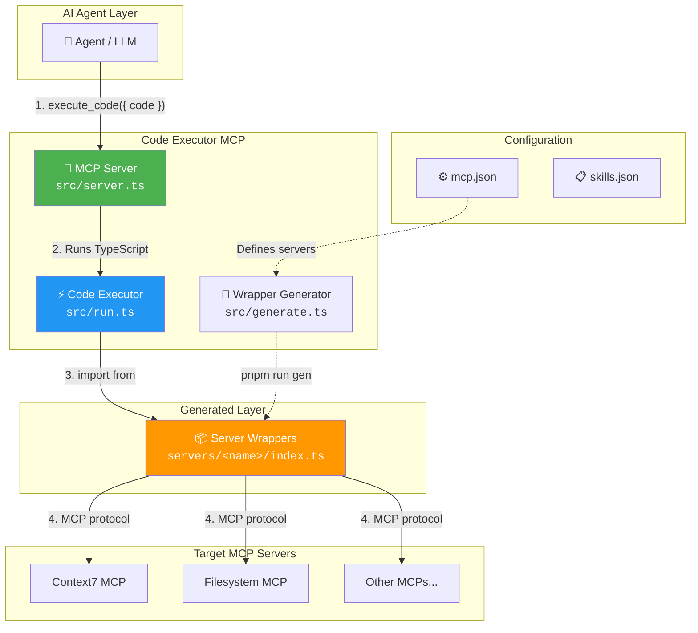
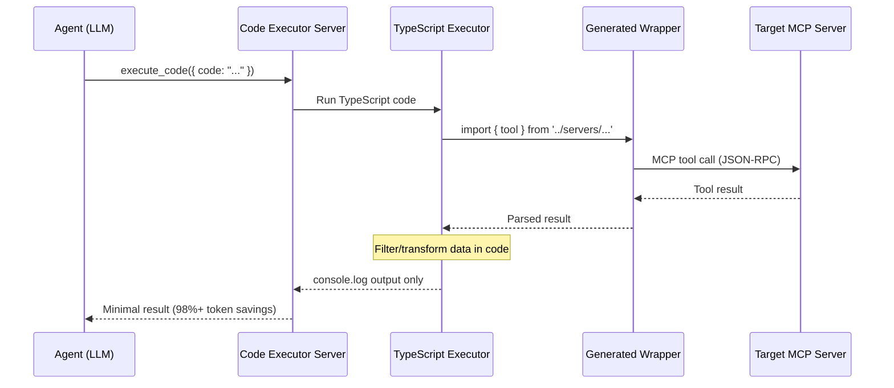
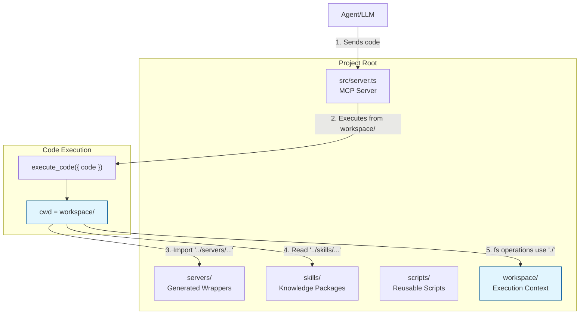

# Code Executor MCP

An MCP server that enables AI agents to execute TypeScript code that calls other MCP tools. This implements the "code execution with MCP" pattern described in [Anthropic's engineering blog](https://www.anthropic.com/engineering/claude-code-execution-mcp) for building more efficient agents.

## The Problem

As MCP usage scales, two patterns increase agent cost and latency:

1. **Tool definitions overload the context window** - Loading all tool definitions upfront consumes hundreds of thousands of tokens
2. **Intermediate results consume additional tokens** - Every tool result passes through the model, even when just piping data between tools

## The Solution

Instead of calling MCP tools directly, agents write TypeScript code that imports generated wrapper files. This enables:

- **Progressive disclosure** - Load only the tools needed for the current task
- **Context-efficient results** - Filter and transform data in code before returning to the model
- **Powerful control flow** - Use loops, conditionals, and error handling with familiar patterns
- **State persistence** - Write intermediate results to files, build reusable skills

**Token savings can reach 98%+** compared to direct tool calls for complex workflows ([Anthropic's analysis](https://www.anthropic.com/engineering/claude-code-execution-mcp)). Our benchmarks measured **97.6% average savings** (ranging from 93.6% to 99.9%). [See benchmark details →](benchmark/README.md)

## Architecture

Code Executor MCP acts as a **meta-MCP server** - it provides tools to execute TypeScript code that can call other MCP servers. This creates a powerful abstraction layer that dramatically reduces token usage.



### How It Works

| Step | Component | Description |
|------|-----------|-------------|
| 1 | Agent | Sends TypeScript code via `execute_code` tool |
| 2 | Server | Receives code and passes to executor |
| 3 | Executor | Compiles and runs TypeScript from `workspace/` directory |
| 4 | Wrappers | Generated files that handle MCP client connections |
| 5 | Target MCPs | External MCP servers that perform actual work |

### Data Flow



**Key insight:** Only `console.log` output returns to the agent. All intermediate data stays in code, avoiding context window bloat.

### Workspace Execution Context

> **Important:** All code executed via `execute_code` runs from the `workspace/` directory as the current working directory (cwd). This affects how imports and file paths work.



**Key implications:**

| Operation | Path | Why |
|-----------|------|-----|
| Import server wrappers | `../servers/<name>/index.js` | Navigate up from `workspace/` to project root |
| Import skills | `../skills/<name>/...` | Same reason |
| File I/O (`fs.readFile`, etc.) | `./filename.txt` | Relative to `workspace/` |
| `console.log` output | Returned to agent | Captured as execution result |

This design isolates executed code's file operations to the `workspace/` directory while allowing imports from generated wrappers.

## Installation

```bash
# Clone the repository
git clone https://github.com/nicobailon/Code-Executor-MCP.git
cd Code-Executor-MCP

# Install dependencies
pnpm install

# Generate wrapper files for configured MCP servers
pnpm run gen
```

## Configuration

### MCP Servers (`mcp.json`)

Configure the MCP servers you want to use:

```json
{
  "servers": {
    "context7": {
      "enabled": true,
      "description": "Fetches up-to-date library documentation and code examples",
      "transport": "stdio",
      "command": "node",
      "args": ["mcps/context7-mcp/dist/index.js"],
      "env": {}
    }
  }
}
```

The `description` field is used by `list_servers_metadata` to provide a quick overview of available servers.

> **Note:** Paths in the `args` array (and other path-related fields) are resolved relative to the project root directory where the Code Executor MCP server is running.

### Environment Variables

| Variable | Description |
|----------|-------------|
| `CODE_EXECUTOR_MCP_CONFIG` | Path to custom `mcp.json` location |
| `CODE_EXECUTOR_SKILLS_CONFIG` | Path to custom `skills.json` location |
| `CODE_EXECUTOR_SKIP_GET_STARTED` | Skip the `get_started` blocking requirement (accepts "true", "1", or "yes") |

### CLI Arguments

The server supports CLI arguments to override config paths:

```bash
# Override mcp.json location
node dist/server.js --mcp-config /path/to/custom/mcp.json

# Override skills.json location
node dist/server.js --skills-config /path/to/custom/skills.json

# Skip the get_started requirement
node dist/server.js --skip-get-started

# All can be combined
node dist/server.js --mcp-config ./my-mcp.json --skills-config ./my-skills.json --skip-get-started
```

Priority: CLI args > environment variables > defaults

### Skills (`skills.json`)

Configure reusable skills (knowledge packages):

```json
{
  "skills": {
    "context7-usage": {
      "enabled": true,
      "tags": ["mcp", "documentation"]
    }
  }
}
```

## Usage

### Basic Workflow

1. **List available servers**
   ```bash
   Tool: list_available_servers
   ```

2. **List tools for a server**
   ```bash
   Tool: list_server_tools
   Args: { "server": "context7" }
   ```

3. **Execute code**
   ```typescript
   import * as context7 from '../servers/context7/index.js';
   
   const libs = await context7.resolveLibraryId.call({
     libraryName: "react"
   });
   console.log(JSON.stringify(libs, null, 2));
   ```

### Import Patterns

> **Note:** These import paths (like `../servers/`) work because code is executed from the `workspace/` directory context. The relative paths navigate from `workspace/` to the project root's `servers/` directory.

```typescript
// Pattern 1: Import entire server
import * as context7 from '../servers/context7/index.js';
await context7.resolveLibraryId.call({ libraryName: "react" });

// Pattern 2: Import specific tool
import { resolveLibraryId } from '../servers/context7/index.js';
await resolveLibraryId.call({ libraryName: "react" });

// Pattern 3: Direct file import
import * as tool from '../servers/context7/resolve-library-id.js';
await tool.call({ libraryName: "react" });
```

### Example: Multi-Tool Workflow

```typescript
import * as context7 from '../servers/context7/index.js';

// Step 1: Find library ID
const libs = await context7.resolveLibraryId.call({
  libraryName: "react"
});
console.log("Libraries:", JSON.stringify(libs, null, 2));

// Step 2: Get docs (use ID from step 1)
const docs = await context7.getLibraryDocs.call({
  context7CompatibleLibraryID: "/facebook/react",
  topic: "hooks useState"
});
console.log("Docs:", docs);
```

## Available Tools

| Tool | Description |
|------|-------------|
| `get_started` | Tutorial on using Code Executor MCP |
| `execute_code` | Run TypeScript code with MCP tool access |
| `run_script` | Run a TypeScript script from the scripts/ directory |
| `list_servers` | List available MCP server wrappers in servers/ directory |
| `list_available_servers` | List MCP servers that are enabled and have wrappers |
| `list_server_tools` | List tools and parameters for a specific server |
| `list_servers_metadata` | Get name and description of all configured servers |
| `get_tool_schema` | Get full parameter schema for a specific tool |
| `validate_code` | Check TypeScript syntax before execution |
| `list_skills` | List available skills in skills/ directory |
| `list_skills_metadata` | Get name and description of all enabled skills |
| `read_skill` | Read skill documentation |
| `list_workspace_files` | List files in workspace/ directory |
| `read_workspace_file` | Read a file from workspace/ |
| `list_scripts` | List available scripts in scripts/ directory |
| `check_server_health` | Diagnose server connection issues |
| `test_server_connection` | Test server connection with timing |
| `get_server_stderr` | Get stderr from server for debugging |

## Project Structure

```
Code-Executor-MCP/
├── src/
│   ├── server.ts      # MCP server implementation
│   ├── mcp.ts         # MCP client for connecting to other servers
│   ├── config.ts      # Configuration loading
│   ├── generate.ts    # Wrapper file generator
│   └── run.ts         # Script runner
├── benchmark/         # Token savings benchmark system
│   ├── src/           # Benchmark implementation
│   ├── scenarios/     # Benchmark test cases
│   └── results/       # Benchmark output
├── servers/           # Generated wrapper files (created by `pnpm run gen`)
├── scripts/           # Reusable TypeScript scripts
├── skills/            # Knowledge packages with documentation
├── workspace/         # Working directory for executed code
├── mcps/              # Bundled MCP servers
├── mcp.json           # MCP server configuration
└── skills.json        # Skills configuration
```

## Documentation

This project includes comprehensive documentation across multiple files:

### Core Documentation

| Document | Description |
|----------|-------------|
| [TOOLS.md](TOOLS.md) | Complete reference for all 18 available tools with parameters, examples, and usage patterns |
| [TESTING.md](TESTING.md) | Testing strategy and plan using Vitest, including test structure and coverage goals |
| [REFERENCE.md](REFERENCE.md) | Background article from Anthropic Engineering on the code execution with MCP pattern |

### Benchmark Documentation

| Document | Description |
|----------|-------------|
| [benchmark/README.md](benchmark/README.md) | Benchmark methodology and how to run token savings measurements |
| [benchmark/results/RESULTS.md](benchmark/results/RESULTS.md) | Detailed benchmark results showing 97.6% average token savings |

### Skills Documentation

Skills are knowledge packages that help with specific tasks. Each skill has a `SKILL.md` file:

| Skill | Description |
|-------|-------------|
| [skills/context7-usage/SKILL.md](skills/context7-usage/SKILL.md) | Tips and best practices for using Context7 MCP server |
| [skills/mcp-tool-discovery/SKILL.md](skills/mcp-tool-discovery/SKILL.md) | Guide for discovering MCP tool parameters and debugging |
| [skills/time-helper/SKILL.md](skills/time-helper/SKILL.md) | Time and timezone conversion capabilities |

### Additional References

| Document | Description |
|----------|-------------|
| [mcps/context7-mcp/README.md](mcps/context7-mcp/README.md) | Context7 MCP server documentation (bundled example) |
| [skills/time-helper/references/iana_timezones.md](skills/time-helper/references/iana_timezones.md) | IANA timezone reference list |

## Key Features

### Auto-Cleanup

By default, executed code automatically cleans up MCP connections when done:

```typescript
// autoExit: true (default) - connections close when event loop idles
const result = await execute_code({ code: "...", autoExit: true });

// autoExit: false - manage cleanup manually if needed
const result = await execute_code({ code: "...", autoExit: false });
```

### Timeout Control

```typescript
// Default timeout: 120 seconds
const result = await execute_code({ 
  code: "...", 
  timeout: 60000  // 60 seconds
});
```

### Skills System

Skills are knowledge packages that help with specific tasks:

```typescript
// List available skills
Tool: list_skills

// Read a skill's documentation
Tool: read_skill
Args: { "skill": "context7-usage" }
```

## Benchmarks

This project includes a benchmark system that validates the token savings claims. Our benchmarks use [tiktoken](https://github.com/openai/tiktoken) to count tokens accurately.

### Benchmark Results

| Scenario | Direct Tokens | Code Execution | Savings |
|----------|---------------|----------------|---------|
| Simple Tool Call | 1,181 | 76 | **93.6%** |
| Multi-Tool Workflow | 11,763 | 198 | **98.3%** |
| Data Filtering | 697,287 | 650 | **99.9%** |
| Loop Operations | 15,970 | 226 | **98.6%** |

**Summary:**
- Total tokens saved: **725,051** (99.8% reduction)
- Average savings: **97.6%**
- Range: 93.6% - 99.9%

> 💡 Anthropic's engineering blog claims "98%+ token savings" - our benchmarks confirm this with measured results averaging 97.6% savings.

### Running Benchmarks

```bash
cd benchmark
pnpm install
pnpm run benchmark
```

See [benchmark/README.md](benchmark/README.md) for methodology and scenario details.

## Development

```bash
# Run in development mode
pnpm run dev

# Build for production
pnpm run build

# Start production server
pnpm run start

# Regenerate wrapper files
pnpm run gen
```

> **Note:** The server logs to stderr (visible in terminal or MCP client logs). This includes startup messages showing which config files are being used.

## Testing

This project uses **Vitest** for testing with comprehensive coverage of all modules.

### Running Tests

```bash
# Run all tests
pnpm test

# Run tests in watch mode
pnpm test:watch

# Run tests with coverage report
pnpm test:coverage

# Run specific test suites
pnpm test:unit         # Unit tests only
pnpm test:integration  # Integration tests only
pnpm test:e2e          # End-to-end tests only
```

### Test Structure

```
tests/
├── setup.ts                    # Global test setup
├── mocks/
│   ├── mcp-client.ts           # Mock MCP client
│   └── fixtures/
│       ├── mcp.json            # Test config fixture
│       ├── skills.json         # Test skills config fixture
│       └── tool-schemas.ts     # Sample tool schemas
├── unit/
│   ├── config.test.ts          # Tests for config.ts
│   ├── mcp.test.ts             # Tests for mcp.ts helpers
│   ├── helpers.test.ts         # Tests for helpers.ts
│   ├── server.test.ts          # Tests for server.ts
│   ├── generate.test.ts        # Tests for generate.ts
│   └── run.test.ts             # Tests for run.ts
├── integration/
│   ├── mcp-connection.test.ts  # MCP server connection tests
│   └── tool-execution.test.ts  # Tool execution tests
└── e2e/
    ├── generate-workflow.test.ts    # Full generate workflow
    └── execute-code-workflow.test.ts # Full execute_code workflow
```

### Coverage

The project maintains **100% test coverage** across all metrics (statements, branches, functions, lines) for core modules:

| Module | Coverage |
|--------|----------|
| config.ts | 100% |
| helpers.ts | 100% |
| mcp.ts | 100% |

Run `pnpm test:coverage` to generate detailed coverage reports in text, JSON, and HTML formats.

## Common Issues

### Import Errors

| Error | Solution |
|-------|----------|
| `Cannot find module` | Add `/index.js` to import path |
| `Missing .js extension` | ESM requires explicit `.js` extensions |
| `is not a function` | Use `.call()` - tools are objects, not functions |

### Connection Issues

1. Check server is enabled in `mcp.json`
2. Run `check_server_health` to diagnose
3. Review stderr with `get_server_stderr`
4. Verify command and args are correct

### Wrapper Generation Failures (`pnpm run gen`)

If wrapper generation fails:

1. **Server not responding**: Ensure the target MCP server is working independently
   ```bash
   # Test the server command directly
   node mcps/context7-mcp/dist/index.js
   ```

2. **Incorrect command/args in mcp.json**: Verify paths are correct and the command exists
   ```json
   {
     "command": "node",
     "args": ["mcps/context7-mcp/dist/index.js"]
   }
   ```

3. **Missing dependencies**: The target server may need to be built first
   ```bash
   cd mcps/context7-mcp && pnpm install && pnpm build
   ```

4. **Check stderr output**: The generator logs errors to stderr - check terminal output for details

## Background

This project implements the code execution pattern described in Anthropic's engineering blog post on building efficient agents with MCP. The core insight is that LLMs are adept at writing code, and developers can leverage this to build agents that interact with MCP servers more efficiently.

Key concepts from the article:

- **Progressive Disclosure**: Present tools as a filesystem, load definitions on-demand
- **Context-Efficient Results**: Filter/transform data in code before returning to model
- **Control Flow in Code**: Loops, conditionals, error handling without agent loop overhead
- **State Persistence**: Save intermediate results, build reusable skills

## Security Considerations

**⚠️ Important security warnings:**

- **Unsandboxed code execution**: The `execute_code` tool runs arbitrary TypeScript code without sandboxing. Only use this in trusted environments.
- **Credential exposure**: Server configurations in `mcp.json` may contain sensitive credentials in the `env` field. Protect this file appropriately.
- **Workspace directory**: Contents of the `workspace/` directory are accessible to executed code. Do not store sensitive data there.

Consider these risks when deploying Code Executor MCP, especially in shared or production environments.

## Contributing

Pull requests are welcome. For major changes, please open an issue first to discuss what you would like to change.

## Acknowledgments

This project uses [Context7](https://context7.com) as the primary example MCP server for demonstrating the code execution pattern. Context7 provides up-to-date library documentation and code examples, making it an ideal candidate for showcasing how Code Executor MCP reduces token usage when fetching documentation.

The Context7 MCP server is bundled in [`mcps/context7-mcp/`](mcps/context7-mcp/) and configured by default in [`mcp.json`](mcp.json). See the [Context7 usage skill](skills/context7-usage/SKILL.md) for best practices on using it effectively.

Special thanks to:
- [Anthropic](https://www.anthropic.com/engineering) for the [code execution with MCP pattern](REFERENCE.md) that inspired this project
- [Upstash](https://upstash.com) for creating and maintaining the Context7 MCP server

## License

[GPL-3.0](https://choosealicense.com/licenses/gpl-3.0/)